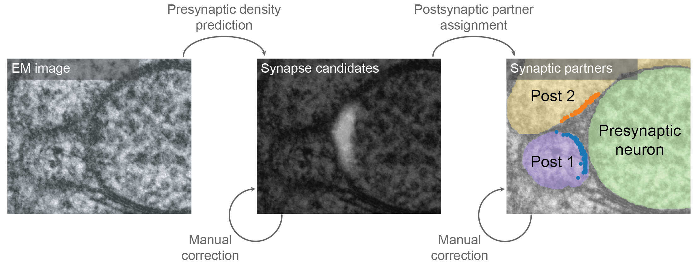

# Cnapse: Semi-automated synapse detection in *C*. *elegans* EM images

*Cnapse* is a tool that enables semi-automated synapse detection in *C*. *elegans* electron microscopy (EM) images. *Cnapse* is designed to detect only chemical synapses as these synapses have clear visual features in EM images such as synaptic vesicles and dark regions near the presynaptic membrane.

## _Cnapse_ pipeline


*Cnapse* consists of two steps for the synapse detection: 1. presynaptic density prediction and 2. postsynaptic partner assignment.

### Presynaptic density prediction
The first step, presynaptic density prediction, takes raw EM image as an input use trained convolutional neural network (CNN)[^1] to detect the synapse candidates.

Refer to inference command in [detectEM](https://github.com/jabae/detectEM).

### Postsynaptic partner assignment
The following step, postsynaptic partner assignment, assigns partners by running Monte Carlo simulation of neurotransmitter diffusion[^2] and the size of the synaptic connections are determined by the proportion of neurotransmitters.
```
synapse_diffuse.py --syn_seg [syn_seg.tif] --cell_seg [cell_seg.tif] --mip [mip] --outpath [outpath.csv]
```
- `syn_seg` : Synpase segmentation volume
- `cell_seg` : Cell segmentation volume
- `syn_info` : List of presynaptic density ids with assigned presynaptic cell ids
- `mip` : Mip level of the volumes ($2^{[mip]}$ $nm$ resolution)
- `outpath` : Path to save result

## Synapse table format
| syn_id | pre | pre_id | post | post_id | x_pos | y_pos | z_pos | size | 
| --- | --- | --- | --- | --- | --- | --- | --- | --- |
- `syn_id` : Synapse segment id
- `pre` : Presynaptic neuron name
- `pre_id` : Presynaptic neuron segment id
- `post` : Postsynaptic neuron name
- `post_id` : Postsynaptic neuron segment id
- `x_pos` : x-axis position of synapse segment centroid in $nm$
- `y_pos` : y-axis position of synapse segment centroid in $nm$
- `z_pos` : z-axis position of synapse segment centroid in $nm$
- `size` : Volume of synapse segment in $nm^3$

[^1]: Ronneberger, Olaf, Philipp Fischer, and Thomas Brox. 2015. “U-Net: Convolutional Networks for Biomedical Image Segmentation.” In Medical Image Computing and Computer-Assisted Intervention – MICCAI 2015, 234–41. Springer International Publishing.
[^2]: Witvliet, Daniel, Ben Mulcahy, James K. Mitchell, Yaron Meirovitch, Daniel R. Berger, Yuelong Wu, Yufang Liu, et al. 2021. “Connectomes across Development Reveal Principles of Brain Maturation.” Nature 596 (7871): 257–61.
